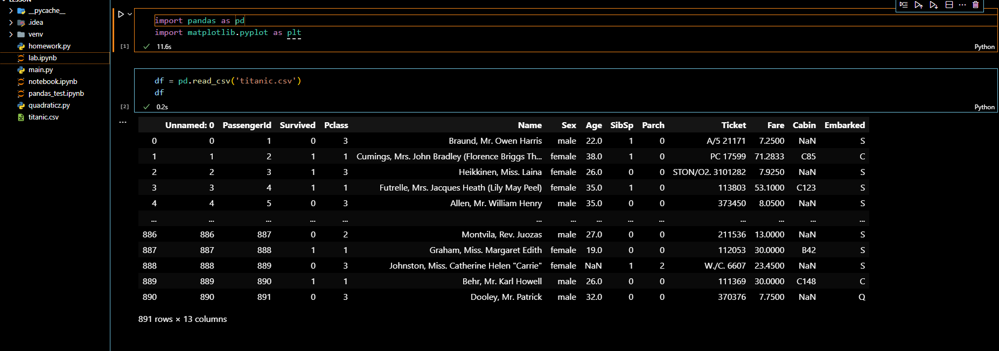
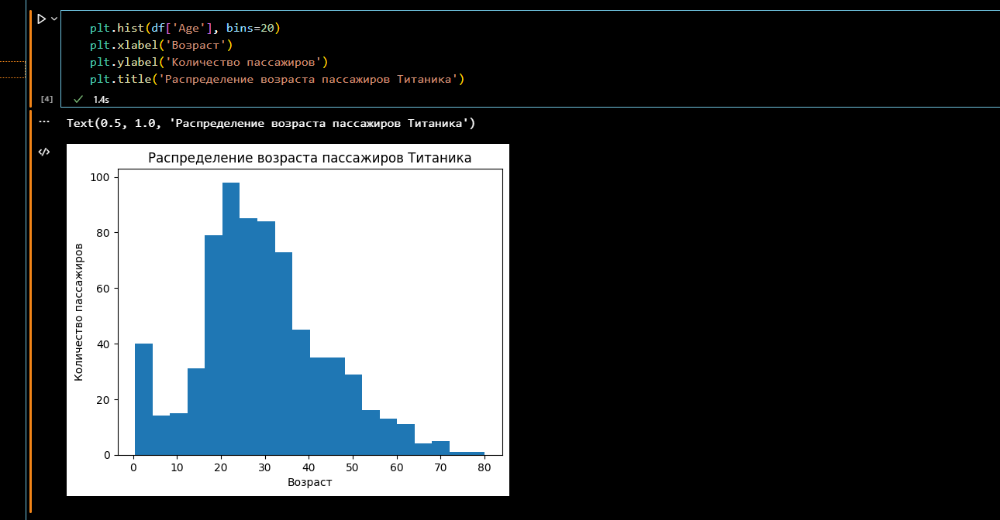
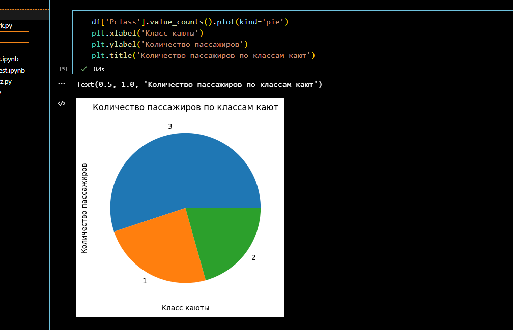
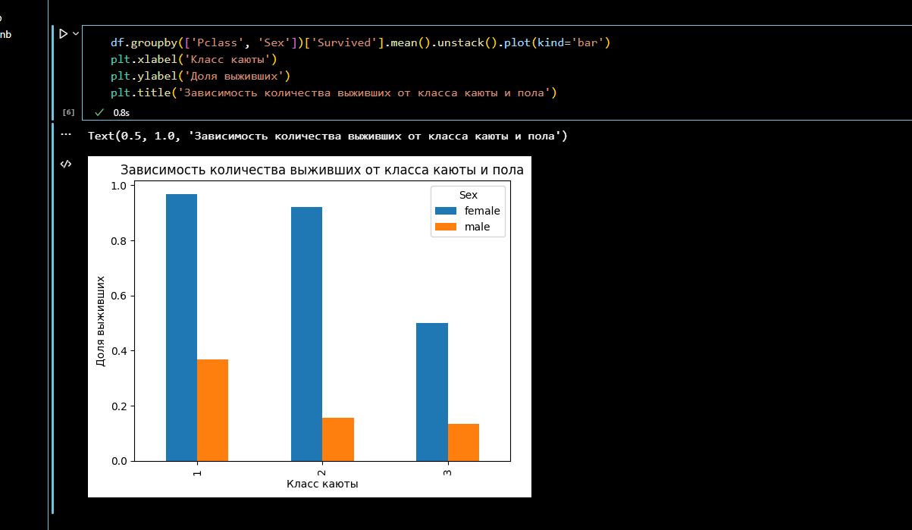
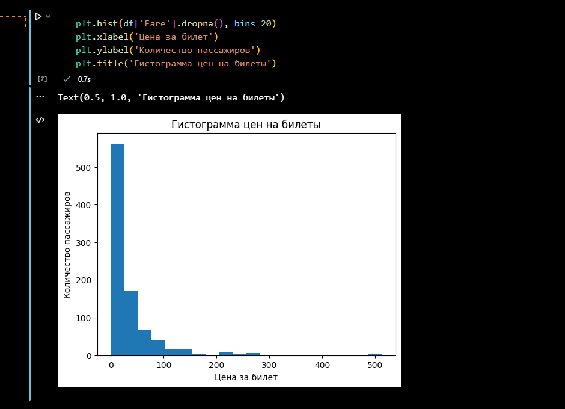
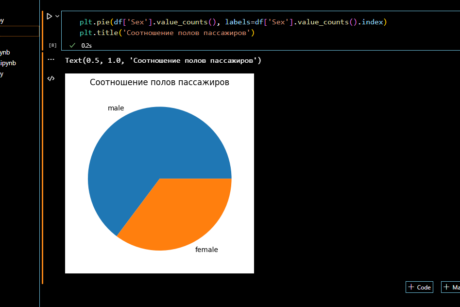

<p align = "center">МИНИСТЕРСТВО НАУКИ И ВЫСШЕГО ОБРАЗОВАНИЯ<br>
РОССИЙСКОЙ ФЕДЕРАЦИИ<br>
ФЕДЕРАЛЬНОЕ ГОСУДАРСТВЕННОЕ БЮДЖЕТНОЕ<br>
ОБРАЗОВАТЕЛЬНОЕ УЧРЕЖДЕНИЕ ВЫСШЕГО ОБРАЗОВАНИЯ<br>
«САХАЛИНСКИЙ ГОСУДАРСТВЕННЫЙ УНИВЕРСИТЕТ»</p>
<br><br><br><br><br><br>
<p align = "center">Институт естественных наук и техносферной безопасности<br>Кафедра информатики<br>Григораш Алексей Владимирович</p>
<br><br><br>
<p align = "center"><br>«<strong>pandas, matplotlib</strong>»<br>01.03.02 Прикладная математика и информатика</p>
<br><br><br><br><br><br><br><br><br><br><br><br>
<p align = "right">Научный руководитель<br>
Лоскутов Артём Владимирович</p>
<br><br><br>
<p align = "center">г. Южно-Сахалинск<br>2023 г.</p>
<br><br><br><br><br><br><br><br>

## Введение:


## Задачи:

Найти любой источник данных в интернете, загрузить с помощью pandas, посчитать основные статистики, построить произвольные графики в matplotlib. 

## Решение:


<div align="center">
    
    
    
    
    
    
    
</div>

## lab.ipynb:

```py

import pandas as pd
import matplotlib.pyplot as plt


df = pd.read_csv('titanic.csv')
df


print('Средний возраст пассажиров:', df['Age'].mean())
print('Медианный возраст пассажиров:', df['Age'].median())
print('Количество выживших пассажиров:', df['Survived'].sum())
print('Количество пассажиров мужского пола:', (df['Sex'] == 'male').sum())
print('Количество пассажиров женского пола:', (df['Sex'] == 'female').sum())


plt.hist(df['Age'], bins=20)
plt.xlabel('Возраст')
plt.ylabel('Количество пассажиров')
plt.title('Распределение возраста пассажиров Титаника')


df['Pclass'].value_counts().plot(kind='pie')
plt.xlabel('Класс каюты')
plt.ylabel('Количество пассажиров')
plt.title('Количество пассажиров по классам кают')


df.groupby(['Pclass', 'Sex'])['Survived'].mean().unstack().plot(kind='bar')
plt.xlabel('Класс каюты')
plt.ylabel('Доля выживших')
plt.title('Зависимость количества выживших от класса каюты и пола')


plt.hist(df['Fare'].dropna(), bins=20)
plt.xlabel('Цена за билет')
plt.ylabel('Количество пассажиров')
plt.title('Гистограмма цен на билеты')


plt.pie(df['Sex'].value_counts(), labels=df['Sex'].value_counts().index)
plt.title('Соотношение полов пассажиров')


```

